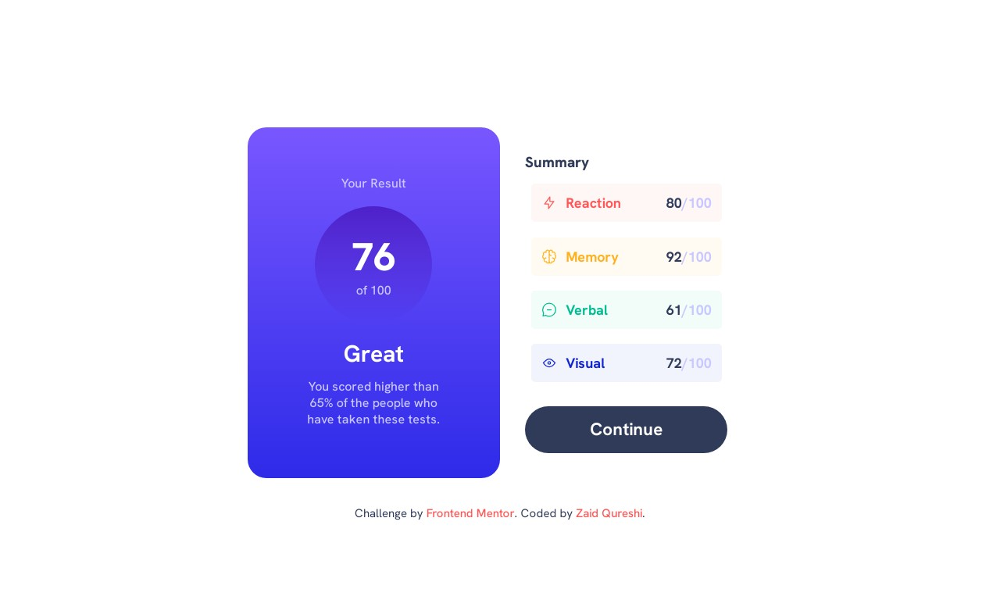
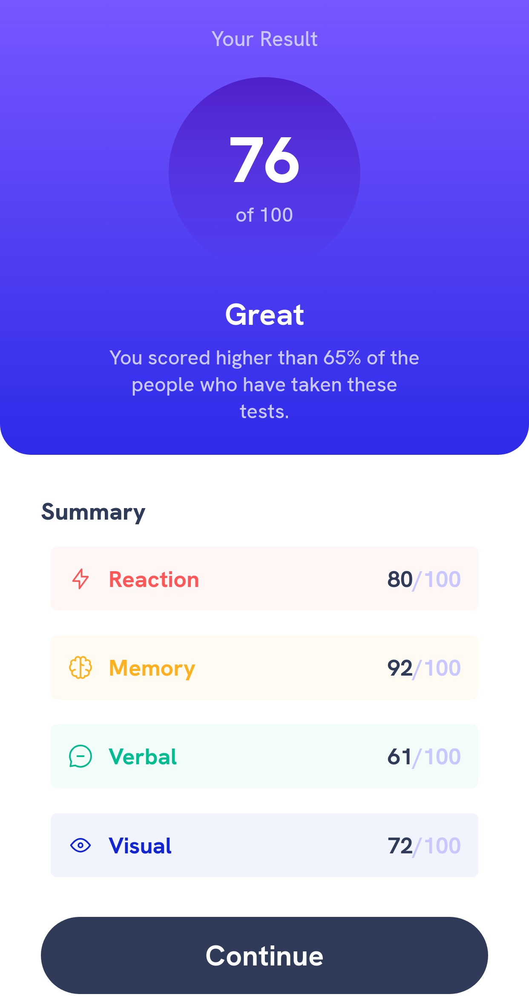

# Frontend Mentor - Results summary component solution

This is a solution to the [Results summary component challenge on Frontend Mentor](https://www.frontendmentor.io/challenges/results-summary-component-CE_K6s0maV). Frontend Mentor challenges help you improve your coding skills by building realistic projects.

## Table of contents

- [Overview](#overview)
  - [The challenge](#the-challenge)
  - [Screenshot](#screenshot)
  - [Links](#links)
- [My process](#my-process)
  - [Built with](#built-with)
  - [What I learned](#what-i-learned)
  - [Useful resources](#useful-resources)
- [Author](#author)

## Overview

### The challenge

Users should be able to:

- View the optimal layout for the interface depending on their device's screen size
- See hover and focus states for all interactive elements on the page

### Screenshot





### Links

- Solution URL: [Github](https://github.com/Zaidqureshi0995/Results-Summary-Challenge)
- Live Site URL: [Github Pages]([https://your-live-site-url.com](https://zaidqureshi0995.github.io/results-summary/)

## My process

### Built with

- Semantic HTML5 markup
- CSS custom properties
- Flexbox
- CSS Grid
- Mobile-first workflow

### What I learned

learned to use different tags and css properties to achieve the desired result.

```html
<li class="summary_score_info">
  <div class="icon_container">
    
    <p class="stat" id="reaction">Reaction</p>
  </div>
  <p class="stat_score"><span class="stat_score_point">80</span>/100</p>
</li>
```

```css
.summary .summary_score .summary_score_info:nth-child(1) {
  color: var(--Light-red);
  background-color: hsla(0, 100%, 67%, 0.05);
}

.summary .summary_score .summary_score_info:nth-child(2) {
  color: var(--Orangey-yellow);
  background-color: hsla(39, 100%, 56%, 0.05);
}

.summary .summary_score .summary_score_info:nth-child(3) {
  color: var(--Green-teal);
  background-color: hsla(166, 100%, 37%, 0.05);
}

.summary .summary_score .summary_score_info:nth-child(4) {
  color: var(--Cobalt-blue);
  background-color: hsla(234, 85%, 45%, 0.05);
}
```

### Useful resources

- [Stackoverflow](https://stackoverflow.com/)
- [W3Schools](https://www.w3schools.com/)

## Author

- Frontend Mentor - [@Zaidqureshi0995](https://www.frontendmentor.io/profile/Zaidqureshi0995)
- Github - [@Zaidqureshi0995](https://github.com/Zaidqureshi0995/)
